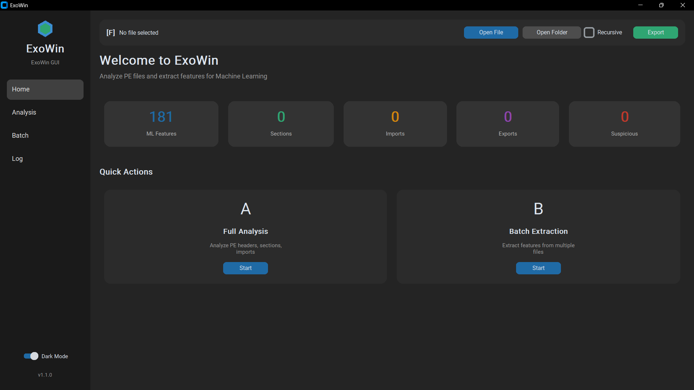

# ExoWin

<p align="center">
  
  
  
  
</p>

<p align="center">
  <b>Static Analysis & ML Feature Extraction for Windows PE Files</b>
</p>

<p align="center">
  <i>A tool for analyzing Windows executables (.exe) and dynamic libraries (.dll) with modern GUI, simplified CLI, and 181 ML features for malware classification.</i>
</p>

---

## Screenshot

<p align="center">
  
</p>

---

## Table of Contents

- [Features](#features)
- [Installation](#installation)
- [Usage](#usage)
- [CLI Commands](#cli-commands)
- [ML Feature Extraction](#ml-feature-extraction)
- [Export Formats](#export-formats)
- [Project Structure](#project-structure)
- [License](#license)

---

## Features

### Comprehensive PE Analysis

| Feature | Description |
|---------|-------------|
| **File Info** | MD5, SHA1, SHA256, SSDeep, Imphash, Entropy |
| **PE Headers** | DOS Header, File Header, Optional Header, Linker Version |
| **Sections** | Name, Size, Entropy, Permissions, Suspicious Indicators |
| **Imports** | DLL dependencies, API calls, Suspicious API detection |
| **Exports** | Exported functions (DLL), Forwarded exports |
| **Strings** | URLs, IPs, Registry keys, File paths, Suspicious patterns |
| **Disassembly** | Entry point disassembly with Capstone |

### Security Analysis

- **Security Features Detection**: ASLR, DEP, CFG, SEH, High Entropy VA, Authenticode
- **Security Scoring**: 0-100 score based on enabled protections
- **Threat Indicators**: Packed/encrypted detection, suspicious permissions

### DLL-Specific Analysis

- **Export Analysis**: Named exports, ordinal-only, forwarded functions
- **DLL Type Detection**: COM DLL, Service DLL, Control Panel, Shell Extension, Proxy DLL
- **DLL Hijacking Detection**: Commonly hijacked DLL names
- **Suspicious Exports**: Inject, Hook, Payload pattern detection

### Machine Learning Ready

- **181 Numerical Features** for ML/AI models
- **Unified EXE/DLL Features**: Single extractor for both file types
- **CSV Export**: Compatible with sklearn, pandas, TensorFlow
- **Batch Processing**: Process entire folders

### Multiple Export Formats

| Format | Description |
|--------|-------------|
| Console | Rich terminal output with colors |
| JSON | Structured data for automation |
| HTML | Interactive web reports |
| Markdown | Documentation-friendly |
| CSV | ML feature datasets |

---

## Installation

### Prerequisites

- Python 3.8+
- Windows OS (recommended for full PE analysis)

### Quick Install

```bash
# Clone repository
git clone https://github.com/ptg14/ExoWin.git
cd exowin

# Create virtual environment (recommended)
python -m venv .venv
.venv\Scripts\activate

# Install dependencies
pip install -r requirements.txt
```

### Dependencies

| Package | Description |
|---------|-------------|
| typer[all] | CLI framework |
| rich | Console formatting |
| pefile | PE file parsing |
| capstone | Disassembly engine |
| ppdeep | Fuzzy hashing (SSDeep) |
| customtkinter | Modern GUI |
| pillow | Image processing |
| jinja2 | HTML template engine |
| peutils | PE utilities |

---

## Usage

### GUI Mode

```bash
python -m exowin gui
```

**Features:**

- Drag & Drop file support
- Browse for files or folders
- Dashboard with statistics
- Dark/Light theme
- Export to multiple formats
- Security Features visualization

### CLI Mode

#### Analyze Files

```bash
# Single file analysis
python -m exowin analyze malware.exe

# With disassembly
python -m exowin analyze --disasm malware.exe

# Export to json/html/markdown
python -m exowin analyze -o report -f json malware.exe

# Or simply by providing a filename with the desired extension
python -m exowin analyze -o report.json malware.exe

# Folder analysis
python -m exowin analyze -f json -o reports samples

# Recursive search
python -m exowin analyze -r -f markdown -o reports samples
```

#### Compare Files

```bash
python -m exowin compare file1.exe file2.exe
```

Output:
- File information comparison (hash, entropy)
- Section comparison
- Suspicious indicator comparison

#### Extract ML Features

```bash
# Single file (the .csv extension is optional)
python -m exowin extract-features sample.exe output.csv

# Batch extraction with label
python -m exowin extract-features -l malware samples dataset.csv

# Recursive extraction
python -m exowin extract-features -r -l benign samples dataset.csv

# Append to existing CSV
python -m exowin extract-features -a -l malware more_samples dataset.csv
```

#### List Available Features

```bash
python -m exowin list-features
```

#### Version

```bash
python -m exowin version
```

---

## CLI Commands

| Command | Description |
|---------|-------------|
| `gui` | Launch graphical user interface |
| `analyze` | Analyze PE file(s) - auto-detects file/folder, EXE/DLL |
| `compare` | Compare two PE files |
| `extract-features` | Extract ML features from PE file(s) |
| `list-features` | List all available ML features (unified for EXE and DLL) |
| `version` | Display ExoWin version |

### `analyze` Options

| Option | Short | Description | Default |
|--------|-------|-------------|---------|
| `--output` | `-o` | Output file/directory path | - |
| `--format` | `-f` | Output format: console, json, html, markdown | console |
| `--recursive` | `-r` | Search subdirectories | False |
| `--disasm` | `-d` | Include disassembly | False |

### `extract-features` Options

| Option | Short | Description | Default |
|--------|-------|-------------|---------|
| `--label` | `-l` | Label for samples | - |
| `--recursive` | `-r` | Search subdirectories | False |
| `--append` | `-a` | Append to existing CSV | False |

---

## ML Feature Extraction

ExoWin extracts **181 numerical features** for machine learning:

### Feature Categories

| Category | Prefix | Count | Examples |
|----------|--------|-------|----------|
| File Properties | `file_` | 5 | `file_size`, `file_entropy`, `overlay_size`,... |
| DOS Header | `dos_` | 2 | `dos_e_magic`, `dos_e_lfanew` |
| File Header | `fh_` | 13 | `fh_machine`, `fh_num_sections`, `fh_timestamp`,... |
| Optional Header | `oh_` | 35 | `oh_size_of_code`, `oh_entry_point`, `oh_checksum`,... |
| Sections | `sec_` | 20 | `sec_num_sections`, `sec_avg_entropy`, `sec_num_wx`,... |
| Imports | `imp_` | 18 | `imp_num_dlls`, `imp_num_functions`, `imp_sus_*`,... |
| Exports | `exp_` | 1 | `exp_num_functions` |
| Resources | `res_` | 9 | `res_num_resources`, `res_total_size`,... |
| Data Directory | `dd_` | 32 | `dd_import_present`, `dd_export_size`,... |
| PE Type | `is_` | 3 | `is_dll`, `is_exe`, `is_driver` |
| DLL Features | `dll_` | 19 | `dll_export_count`, `dll_security_score`,... |
| Behavioral | `has_` | 8 | `has_anti_debugging`, `has_injection_apis`,... |
| Statistical | - | 16 | `printable_ratio`, `byte_stddev`, `packed_score`,... |

### Suspicious API Categories

| Feature | APIs Detected |
|---------|---------------|
| `imp_sus_process_injection` | CreateRemoteThread, WriteProcessMemory, VirtualAllocEx,... |
| `imp_sus_keylogging` | SetWindowsHookEx, GetAsyncKeyState,... |
| `imp_sus_anti_debugging` | IsDebuggerPresent, CheckRemoteDebuggerPresent,... |
| `imp_sus_network` | InternetOpen, URLDownloadToFile, WSAStartup,... |
| `imp_sus_registry` | RegSetValue, RegCreateKey,... |
| `imp_sus_file_operations` | CreateFile, WriteFile, DeleteFile,... |
| `imp_sus_persistence` | CreateService, StartService,... |
| `imp_sus_crypto` | CryptEncrypt, CryptDecrypt,... |
| `imp_sus_anti_vm` | CreateToolhelp32Snapshot, Process32First,... |

---

## Export Formats

### Console

Rich terminal output with colors and formatting using Rich library.

### JSON

Structured data format for automation and integration.

### HTML

Interactive web report with styling and collapsible sections.

### Markdown

Documentation-ready format for reports.

### CSV

ML-ready feature dataset with 181 columns.


---

## Project Structure

```
exowin/
├── __init__.py              # Package init, version 1.1.0
├── __main__.py              # Entry point (python -m exowin)
├── .gitignore               # Git ignore patterns
├── analyzer.py              # Core analysis engine
├── cli.py                   # CLI commands (Typer) - 6 commands
├── gui.py                   # GUI (CustomTkinter) - 2000+ lines
├── README.md                # Project README
├── requirements.txt         # Dependency list
│
├── extractors/              # Feature extractors
│   ├── __init__.py          # Package init
│   ├── base.py              # Base extractor class
│   ├── disasm.py            # Disassembly (Capstone)
│   ├── dll_features.py      # DLL-specific features
│   ├── file_info.py         # File information (hashes, entropy)
│   ├── headers.py           # PE headers (DOS, File, Optional)
│   ├── imports.py           # Imports/Exports analysis
│   ├── ml_features.py       # ML feature extraction (181 features)
│   ├── sections.py          # Section analysis
│   └── strings.py           # String extraction
│
├── reporters/               # Report generators
│   ├── __init__.py          # Package init
│   ├── base.py              # Base reporter class
│   ├── console_reporter.py  # Console output
│   ├── csv_reporter.py      # CSV export
│   ├── html_reporter.py     # HTML report
│   ├── json_reporter.py     # JSON export
│   └── markdown_reporter.py # Markdown export
│
└── utils/
    ├── __init__.py          # Package init
    └── pe_loader.py         # PE file loading utilities
```

---

## Acknowledgments

- [pefile](https://github.com/erocarrera/pefile) - PE file parsing
- [Capstone](https://www.capstone-engine.org/) - Disassembly framework
- [Rich](https://github.com/Textualize/rich) - Terminal formatting
- [CustomTkinter](https://github.com/TomSchimansky/CustomTkinter) - Modern GUI
- [Typer](https://typer.tiangolo.com/) - CLI framework

---

## License

This project is licensed under the **MIT License** - see the [LICENSE](LICENSE) file for details.

---

## Contact

- **Issues**: [GitHub Issues](https://github.com/ptg14/ExoWin/issues)

---

<p align="center">
  <b>Have fun!!!</b>
</p>
